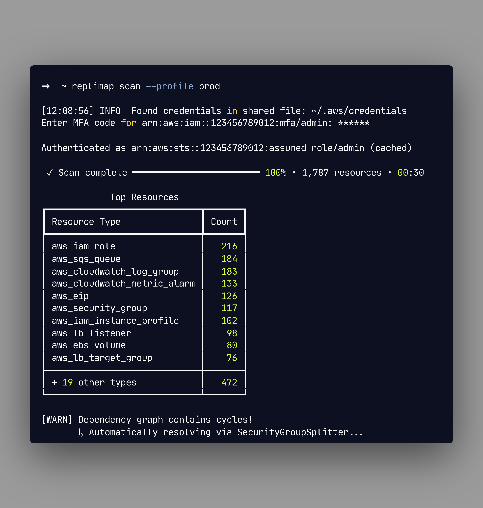

<!--
<p align="center">
  
</p>
-->

<h1 align="center">RepliMap</h1>

<p align="center">
  <strong>AWS Infrastructure Intelligence Engine</strong>
</p>

<p align="center">
  Reverse-engineer any AWS account. Visualize dependencies. Generate Terraform. Optimize costs.
</p>

<p align="center">
  <a href="#quick-start">Quick Start</a> •
  <a href="#features">Features</a> •
  <a href="#use-cases">Use Cases</a> •
  <a href="#-limitations--scope">Limitations</a> •
  <a href="#-frequently-asked-questions">FAQ</a> •
  <a href="#documentation">Docs</a>
</p>

<p align="center">
  <a href="https://pypi.org/project/replimap/">
    
  </a>
  
  <a href="LICENSE">
    
  </a>
</p>

<p align="center">
  <a href="https://dev.to/davidlu1001/two-terraform-traps-that-burned-me-hidden-defaults-circular-dependencies-4n74">
    
  </a>
  <a href="https://news.ycombinator.com/item?id=46720620">
    
  </a>
  <a href="https://twitter.com/davidlu1001">
    
  </a>
</p>

<p align="center">
  
</p>

---

> **👋 About This Repository**
> RepliMap is a **commercial tool** built with a **"Local-First"** architecture.
> This repository (`replimap-community`) hosts **documentation**, **issue tracking**, and **examples**.
> The core engine is distributed via [PyPI](https://pypi.org/project/replimap/).
> Your AWS credentials and data **never leave your machine** — the only network call is license key validation.

---

> **RepliMap** is an **AWS Infrastructure Intelligence Engine** for DevOps and SRE teams.
> *Not to be confused with RepliMap HD mapping software for autonomous vehicles.*

---

## 💡 TL;DR

**RepliMap** is a read-only CLI tool that reverse-engineers existing AWS infrastructure into production-ready Terraform code.

**Core capabilities:**
- **Graph Engine**: Uses Tarjan's algorithm to detect Strongly Connected Components (SCCs) and automatically resolve circular dependencies (e.g., Security Groups referencing each other)
- **Smart Sanitization**: Filters read-only fields (like `root_block_device.device_name`) that cause accidental resource destruction on `terraform apply`
- **Local-First**: Your AWS credentials and infrastructure data never leave your machine

**Use RepliMap when:**
- You inherited a ClickOps AWS account and need Terraform
- `terraform import` keeps failing with cycle errors
- You need to clone prod to staging without manual work

**Keywords**: AWS, Terraform, Infrastructure as Code, IaC, reverse engineering, circular dependencies, Tarjan algorithm, SCC, brownfield migration, ClickOps to GitOps, Security Group cycles, terraform import alternative

---

## The Problem

You inherited an AWS account. Or maybe you built it yourself over 3 years of "just one more click."

Now you have:
- 🤷 **500+ resources** and no idea what connects to what
- 😰 **No Terraform** — everything was ClickOps
- 💸 **Oversized instances** burning money 24/7
- 📋 **SOC2 audit next month** — good luck

Sound familiar?

## The Solution

**RepliMap scans your AWS, builds a dependency graph, and gives you superpowers.**

```
┌─────────────────────────────────────────────────────────────────────────┐
│                                                                         │
│   $ replimap -p prod scan                                               │
│                                                                         │
│   ✓ Scanned 847 resources in 23.4s                                      │
│   ✓ Mapped 1,203 dependencies                                           │
│   ✓ Found 12 compliance issues                                          │
│   ✓ Identified $2,847/month in savings                                  │
│                                                                         │
│   Your infrastructure graph is ready.                                   │
│                                                                         │
└─────────────────────────────────────────────────────────────────────────┘
```

---

## Features

### 🔍 Scan & Understand

**See your infrastructure like never before.**

RepliMap builds a complete dependency graph of your AWS account using a sophisticated graph engine. Finally understand what connects to what — and what breaks if you touch it.

```bash
# Scan your AWS account
replimap -p prod -r ap-southeast-2 scan

# Visualize dependencies
replimap -p prod -r us-east-1 graph -o architecture.html

# "What happens if I delete this security group?"
replimap -p prod -r us-east-1 deps sg-0a1b2c3d4e
```

<details>
<summary>📸 See example dependency graph</summary>

```
                    ┌─────────────┐
                    │   ALB       │
                    │ (public)    │
                    └──────┬──────┘
                           │
              ┌────────────┼────────────┐
              │            │            │
        ┌─────▼─────┐ ┌────▼────┐ ┌─────▼─────┐
        │  EC2 #1   │ │  EC2 #2 │ │  EC2 #3   │
        │ (web)     │ │  (web)  │ │  (web)    │
        └─────┬─────┘ └────┬────┘ └─────┬─────┘
              │            │            │
              └────────────┼────────────┘
                           │
                    ┌──────▼──────┐
                    │     RDS     │
                    │  (primary)  │
                    └──────┬──────┘
                           │
                    ┌──────▼──────┐
                    │ ElastiCache │
                    │  (redis)    │
                    └─────────────┘
```

</details>

### 🏗️ Codify: ClickOps to Terraform

**Stop writing HCL by hand. Let the engine do it.**

You built your infrastructure in the console. Now you need to manage it with code. `codify` scans your existing resources and generates production-ready Terraform, complete with `import` blocks to sync your state instantly.

```bash
# Reverse-engineer your existing infrastructure
replimap codify -p prod -r us-east-1 -o ./terraform

# Example output
Authenticated as arn:aws:sts::123456789012:assumed-role/admin/user
Using cached scan (2m ago) • 1,772 resources • 1,655 dependencies

# Output structure (18 files)
terraform/
├── README.md
├── alb.tf
├── backend.tf
├── compute.tf
├── ec2.tf
├── elasticache.tf
├── iam_roles.tf
├── imports.tf        # Terraform 1.5+ import blocks
├── messaging.tf
├── monitoring.tf
├── networking.tf
├── rds.tf
├── s3.tf
├── security_groups.tf
├── storage.tf
├── tfplan.txt
├── variables.tf
└── vpc.tf
```

**Why RepliMap's code generation is different:**

- ✅ **Handles `root_block_device` defaults** — prevents accidental EC2 replacement ([see the trap](https://www.reddit.com/r/devops/comments/1qiun82/psa_the_root_block_device_gotcha_that_almost_cost/))
- ✅ **Resolves circular dependencies** — auto-splits Security Group rules
- ✅ **Filters AWS system tags** — no more `aws:*` tag rejection errors
- ✅ **Extracts variables** — not just hardcoded values

**Supported IaC formats:**
- ✅ Terraform (HCL)
- 🔜 CloudFormation (YAML/JSON)
- 🔜 Pulumi (TypeScript)
- 🔜 CDK (TypeScript)

### 👯 Clone & Right-Size Environments

**Stop paying production prices for dev environments.**

Need a staging environment that mirrors production? Don't just copy it—optimize it.
RepliMap's `clone` command duplicates your architecture but automatically downsizes instances (e.g., `m5.2xlarge` → `t3.medium`) and strips sensitive data, saving you 40-60% on non-prod costs.

```bash
# Clone prod to staging with automatic cost optimization
replimap clone --profile prod --region us-east-1 --output-dir ./staging-tf --rename-pattern "prod:staging" --mode generate

# See what you'll save before applying
replimap -p prod -r us-east-1 cost
```

```
┌─────────────────────────────────────────────────────────────────────────┐
│                        💰 Right-Sizer Report                            │
├─────────────────────────────────────────────────────────────────────────┤
│                                                                         │
│  Resource              Original (Prod)  Clone (Dev)      Monthly Savings│
│  ─────────────────────────────────────────────────────────────────────  │
│  web-server-1          m5.2xlarge       t3.large         $198.56        │
│  rds-cluster           db.r5.2xlarge    db.r5.large      $365.00        │
│  elasticache           r6g.xlarge       r6g.large        $131.40        │
│                                                                         │
│  ─────────────────────────────────────────────────────────────────────  │
│  TOTAL MONTHLY SAVINGS                                 $1,017.62        │
│                                                                         │
└─────────────────────────────────────────────────────────────────────────┘
```

### ✅ Audit Compliance

**Find compliance gaps before your auditor does.**

Built-in security and compliance scanning powered by industry-standard rules. Get actionable findings with auto-generated remediation code.

```bash
# Run compliance audit
replimap -p prod -r us-east-1 audit

# Generate fix code (from audit JSON output)
replimap -p prod -r us-east-1 audit --format json -o audit_report.json
replimap remediate audit_report.json -o ./fixes
```

```
┌─────────────────────────────────────────────────────────────────────────┐
│                        🔒 Compliance Report                             │
├─────────────────────────────────────────────────────────────────────────┤
│                                                                         │
│  Framework: SOC2 Type II                                                │
│  Resources Scanned: 847                                                 │
│  Findings: 12                                                           │
│                                                                         │
│  ┌────────────────────────────────────────────────────────────────────┐ │
│  │ 🔴 CRITICAL (2)                                                    │ │
│  │    • S3 bucket 'logs-prod' has public access enabled               │ │
│  │    • RDS instance 'main-db' not encrypted at rest                  │ │
│  │                                                                    │ │
│  │ 🟡 HIGH (4)                                                        │ │
│  │    • Security group sg-xxx allows 0.0.0.0/0 on port 22            │ │
│  │    • IAM user 'deploy-bot' has inline policies                     │ │
│  │    • CloudTrail not enabled in ap-southeast-2                      │ │
│  │    • EBS volumes not encrypted by default                          │ │
│  │                                                                    │ │
│  │ 🟢 MEDIUM (6)                                                      │ │
│  │    • [View full report: ./audit-report.html]                       │ │
│  └────────────────────────────────────────────────────────────────────┘ │
│                                                                         │
└─────────────────────────────────────────────────────────────────────────┘
```

### 🔄 Detect Drift

**Know when reality diverges from your Terraform.**

Compare your actual AWS state against your Terraform code. Catch ClickOps changes before they cause incidents.

```bash
# Detect drift from local state file
replimap -p prod -r us-east-1 drift --state ./terraform.tfstate

# Detect drift from remote S3 state
replimap -p prod -r us-east-1 drift --state-bucket my-tf-state --state-key prod/terraform.tfstate

# Output
Drift detected in 3 resources:
  • aws_security_group.web: ingress rule added (port 8080)
  • aws_instance.api: instance_type changed (t3.large → t3.xlarge)
  • aws_s3_bucket.logs: versioning disabled
```

---

## Use Cases

### 🚀 Startup Scale-Up

> "We built everything in the console. Now we need Terraform."

Stop the painful manual migration. RepliMap reverse-engineers your entire infrastructure and generates production-ready IaC. From ClickOps to GitOps in an afternoon, not a quarter.

### 🧪 Test & Staging Environments

> "I need a copy of prod for testing. By tomorrow."

Spin up production-identical environments in minutes, not days:

- **Legacy Project Handoff** — Inherited a mess? Scan it, clone it, understand it.
- **Ephemeral Test Environments** — Replicate prod, run tests, destroy. Rinse and repeat.
- **Chaos Engineering** — Clone prod for Chaos Monkey experiments without risking the real thing.
- **DR Drills** — Quarterly disaster recovery exercises? One command to duplicate your entire stack.

```bash
# Clone prod to staging with cost-optimized instances
replimap clone --profile prod --region us-east-1 --output-dir ./staging-tf --rename-pattern "prod:staging" --mode generate

# Test complete? Destroy with confidence
cd staging-tf && terraform destroy
```

### 💸 FinOps & Cost Optimization

> "We're spending $50k/month but don't know where it goes."

RepliMap maps every resource, identifies waste, and shows exactly where to cut. Right-size instances, find unused resources, optimize reserved capacity. See savings before you commit.

### 🔒 SOC2 / ISO27001 Preparation

> "Audit is in 30 days. We have no documentation."

RepliMap generates architecture diagrams, compliance reports, and remediation code. Turn audit prep from months to days. Auditors love the dependency graphs.

### 🏢 M&A Due Diligence

> "We're acquiring a company. What does their AWS look like?"

RepliMap gives you complete visibility into any AWS account in minutes. Understand architecture quality, compliance posture, and cost structure — before signing the term sheet.

### 🌍 Disaster Recovery

> "We need to replicate prod to another region. Yesterday."

Clone your entire infrastructure to a DR region with one command. All dependencies mapped, all configurations preserved. Test your DR plan without the drama.

---

## Quick Start

### Installation

```bash
# Using pipx (recommended - isolated environment)
pipx install replimap

# Using pip
pip install replimap

# Verify installation
replimap --version
```

### Your First Scan

```bash
# 1. Configure AWS credentials (if not already done)
aws configure --profile myaccount

# 2. Scan your infrastructure
replimap -p myaccount -r us-east-1 scan

# 3. Explore the results
replimap -p myaccount -r us-east-1 graph -o architecture.html
open architecture.html
```

### Generate Terraform

```bash
# Generate Terraform from scanned infrastructure
replimap codify -p prod -r us-east-1 -o ./terraform

# Review and apply
cd terraform
terraform init
terraform plan
```

---

## 📖 Commands

| Command | Description |
|---------|-------------|
| `replimap scan` | Scan AWS resources and build dependency graph |
| `replimap codify` | Transform ClickOps AWS infrastructure into production-ready Terraform code |
| `replimap clone` | Clone AWS environment to Infrastructure-as-Code with cost optimization |
| `replimap graph` | Generate visual dependency graph |
| `replimap analyze` | Analyze graph for critical resources, SPOFs, blast radius |
| `replimap deps` | Explore dependencies for a resource |
| `replimap cost` | Estimate monthly AWS costs |
| `replimap audit` | Run security audit on AWS infrastructure |
| `replimap drift` | Detect infrastructure drift between Terraform state and AWS |
| `replimap remediate` | Generate Terraform remediation code from audit JSON |

<details>
<summary>View all commands</summary>

```bash
replimap --help

Usage: replimap [OPTIONS] COMMAND [ARGS]...

AWS Infrastructure Intelligence Engine

Options:
  --quiet               -q            Suppress verbose output
  --version             -V            Show version and exit
  --privacy                           Show privacy and data handling information
  --profile             -p      TEXT  AWS profile name (can also be set per-command)
  --region              -r      TEXT  AWS region (can also be set per-command)
  --help                -h            Show this message and exit.

Core Commands:
  scan            Scan AWS resources and build dependency graph.
  graph           Generate visual dependency graph of AWS infrastructure.
  load            Load and display a saved graph.
  profiles        List available AWS profiles.

Infrastructure as Code:
  clone           Clone AWS environment to Infrastructure-as-Code.
  codify          Transform ClickOps AWS infrastructure into production-ready Terraform code.
  remediate       Generate Terraform remediation code from an audit JSON file.

Analysis:
  analyze         Analyze a resource dependency graph for critical infrastructure.
  deps            Explore dependencies for a resource.
  drift           Detect infrastructure drift between Terraform state and AWS.
  validate        Validate infrastructure against topology constraints.
  drift-offline   Offline drift detection

Cost Optimization:
  cost            Estimate monthly AWS costs for your infrastructure.
  unused          Detect unused and underutilized AWS resources.
  trends          Analyze AWS cost trends and detect anomalies.
  transfer        Analyze data transfer costs and optimization opportunities.

Security & Compliance:
  audit           Run security audit on AWS infrastructure.
  iam             Generate least-privilege IAM policies from graph analysis
  trust-center    Trust Center API auditing for compliance

Configuration:
  doctor          Run environment health checks.
  cache           Credential cache management
  scan-cache      Scan result cache management
  license         License management commands
  upgrade         Upgrade your RepliMap plan
  completion      Generate shell completion scripts
  decisions       Manage user decisions (suppression, extraction, etc.)

Help & Debugging:
  explain         Get detailed information about an error code.
  errors          List all error codes.

Disaster Recovery:
  snapshot        Infrastructure snapshots for change tracking
  dr              Disaster Recovery readiness assessment
```

</details>

---

## 🔧 Configuration

### AWS Credentials

RepliMap uses standard AWS credential chain:

```bash
# Option 1: AWS CLI profile (recommended)
replimap -p prod scan

# Option 2: Environment variables
export AWS_ACCESS_KEY_ID=xxx
export AWS_SECRET_ACCESS_KEY=xxx
replimap scan

# Option 3: IAM role (EC2/ECS/Lambda)
replimap scan  # Auto-detects instance role
```

### Required IAM Permissions

RepliMap only needs **read-only** access. See [IAM_POLICY.md](IAM_POLICY.md) for the minimal policy.

```json
{
  "Version": "2012-10-17",
  "Statement": [
    {
      "Effect": "Allow",
      "Action": [
        "ec2:Describe*",
        "rds:Describe*",
        "elasticache:Describe*",
        "s3:GetBucket*",
        "s3:ListBucket*",
        "lambda:List*",
        "lambda:GetFunction*"
      ],
      "Resource": "*"
    }
  ]
}
```

---

## 🏗️ Architecture

RepliMap is built around a **Graph Engine** powered by NetworkX. This isn't just a CLI wrapper around AWS APIs — it's an infrastructure intelligence platform.

The **Graph Engine** is the secret sauce: it transforms discrete cloud resources into a connected dependency graph, enabling impact analysis, visualization, and intelligent code generation that understands relationships.

```
┌──────────────────────────────────────────────────────────────────┐
│                         RepliMap Architecture                    │
├──────────────────────────────────────────────────────────────────┤
│                                                                  │
│   ┌─────────────┐     ┌─────────────┐     ┌─────────────┐       │
│   │  Scanners   │────▶│ ⭐ Graph    │────▶│  Renderers  │       │
│   │  (AWS API)  │     │   Engine ⭐ │     │  (Terraform)│       │
│   └─────────────┘     └──────┬──────┘     └─────────────┘       │
│                              │                                   │
│         ┌────────────────────┼────────────────────┐             │
│         │                    │                    │             │
│         ▼                    ▼                    ▼             │
│   ┌───────────┐      ┌─────────────┐      ┌───────────┐        │
│   │   Audit   │      │ Right-Sizer │      │   Drift   │        │
│   │  Engine   │      │   Engine    │      │  Detector │        │
│   └───────────┘      └─────────────┘      └───────────┘        │
│                                                                  │
└──────────────────────────────────────────────────────────────────┘
```

### How It Works: The Brownfield Migration Problem

RepliMap is not just a `terraform import` wrapper. It's a **graph-based engine** designed to handle the "Brownfield Migration" problem where standard tools fail.

**The Core Problem**: Terraform requires a **Directed Acyclic Graph (DAG)** — it needs to know "create A before B." But AWS allows **cycles**. The classic example:

```
     ┌──────────────┐
     ▼              │
  [SG-App]       [SG-DB]
     │              ▲
     └──────────────┘
```

`SG-App` allows traffic to `SG-DB`. `SG-DB` allows traffic from `SG-App`. A cycle. Standard tools crash or produce broken code. RepliMap solves this.

### Step 1: Cycle Detection (Tarjan's Algorithm)

We use **Tarjan's algorithm** to find **Strongly Connected Components (SCCs)** — clusters of resources that are circularly dependent.

- If a resource is part of a normal DAG → leave it alone
- If a group forms a cycle (SCC) → flag for surgery

### Step 2: Cycle Resolution ("Shell & Fill" Pattern)

For each SCC, we apply the **Shell & Fill** pattern:

1. **Shell**: Strip the resource to pure identity (e.g., `aws_security_group` with no inline rules)
2. **Fill**: Extract logic into standalone resources (e.g., `aws_security_group_rule`)

```
Before (Cycle - Terraform fails):
  [SG-App with rules] ←→ [SG-DB with rules]

After (DAG - Terraform succeeds):
  [SG-App empty] ← [Rule: App→DB]
  [SG-DB empty]  ← [Rule: DB←App]
```

### Step 3: Sanitization

The AWS API returns fields that look normal but are **read-only** in Terraform (e.g., `root_block_device.device_name`).

If you include them in your code, Terraform shows **"must be replaced"** and tries to destroy your instance.

RepliMap's Sanitizer automatically filters these dangerous fields before generating HCL.

### Core Components

| Component | Description |
|-----------|-------------|
| **Graph Engine** | NetworkX-based dependency graph with Tarjan's SCC for cycle detection |
| **Scanners** | Async AWS API clients for 20+ resource types |
| **Renderers** | Jinja2 templates for Terraform/CloudFormation generation |
| **Right-Sizer** | Rule-based + API cost optimization engine |
| **Audit Engine** | Compliance scanning with Checkov integration |

### Supported Resources

<details>
<summary>View all 24 supported resource types</summary>

| Category | Resources |
|----------|-----------|
| **Compute** | EC2, Lambda, ECS, EKS |
| **Database** | RDS, Aurora, DynamoDB, ElastiCache |
| **Network** | VPC, Subnet, Security Group, Route Table, NAT Gateway, Internet Gateway, ALB/NLB |
| **Storage** | S3, EBS, EFS |
| **Security** | IAM Role, IAM Policy, KMS Key, Secrets Manager |
| **Other** | CloudWatch, SNS, SQS |

</details>

---

## 📊 Comparison

### RepliMap vs Terraformer

| Feature | RepliMap | Terraformer |
|---------|----------|-------------|
| Dependency Graph | ✅ Full graph with cycle detection | ❌ No dependency tracking |
| Code Quality | ✅ Clean, modular, variables extracted | ⚠️ Verbose, hardcoded values |
| Cost Optimization | ✅ Built-in Right-Sizer | ❌ None |
| Compliance Audit | ✅ SOC2/CIS built-in | ❌ None |
| Drift Detection | ✅ Yes | ❌ No |
| Visualization | ✅ Interactive HTML graphs | ❌ None |
| Active Development | ✅ Yes | ⚠️ Slow |

### RepliMap vs Former2

| Feature | RepliMap | Former2 |
|---------|----------|---------|
| Architecture | CLI (local) | Browser-based |
| Large Environments | ✅ Handles 1000+ resources | ⚠️ Browser memory limits |
| Dependency Analysis | ✅ Full graph | ⚠️ Limited |
| Cost Analysis | ✅ Yes | ❌ No |
| Data Privacy | ✅ Data stays local | ⚠️ Runs in browser |

---

## 💼 Pricing

### Community (Free)

- ✅ Unlimited scans
- ✅ Preview generated Terraform
- ✅ Basic compliance audit
- ✅ 7-day history retention
- 📊 Exports with watermark

### Pro ($29/mo)

- ✅ Everything in Community
- ✅ Download Terraform code
- ✅ Cost Diff comparison
- ✅ 30-day history retention
- ✅ No watermark on exports
- ✅ 3 AWS accounts
- ✅ Email support (48h SLA)

### Team ($99/mo)

- ✅ Everything in Pro
- ✅ Drift detection & alerts
- ✅ CI/CD integration (`--fail-on-drift`)
- ✅ Trust Center compliance
- ✅ PDF audit reports
- ✅ 10 AWS accounts
- ✅ Priority support (24h SLA)

### Sovereign ($2,500/mo)

- ✅ Everything in Team
- ✅ Offline activation
- ✅ Digital signatures
- ✅ APRA/RBNZ compliance
- ✅ White-label option
- ✅ Unlimited AWS accounts
- ✅ Dedicated support (4h SLA)

[View full pricing →](https://www.replimap.com/#pricing)

---

## 🔒 Security & Privacy

**Your data never leaves your machine.**

- ✅ RepliMap runs entirely client-side
- ✅ No cloud account required
- ✅ Read-only AWS access (no modifications)
- ✅ Sensitive data (passwords, keys) automatically redacted
- ✅ SOC2-compliant design

---

## ⚠️ Limitations & Scope

Understanding what RepliMap can and cannot do helps set correct expectations.

### ✅ What RepliMap Does

| Capability | Description |
|------------|-------------|
| **Read-only scanning** | Uses only `Describe*` and `List*` AWS API calls |
| **Terraform generation** | Outputs clean HCL with proper variable extraction |
| **CloudFormation generation** | Outputs YAML/JSON templates |
| **Circular dependency resolution** | Automatically splits Security Group cycles |
| **Read-only field sanitization** | Prevents accidental resource recreation |
| **Local execution** | All processing happens on your machine |

### ❌ What RepliMap Does NOT Do

| Limitation | Explanation |
|------------|-------------|
| **No multi-cloud** | AWS only. Azure and GCP are not supported yet. |
| **No auto-apply** | Does not run `terraform apply`. You review and apply manually. |
| **No write operations** | Never creates, modifies, or deletes AWS resources. |
| **No data access** | Does not read S3 bucket contents, RDS data, or secrets values. |
| **No credential storage** | AWS credentials are never stored or transmitted. |

### 📊 Current Resource Coverage

24 resource types including: EC2, RDS, Aurora, VPC, Subnet, Security Group, Route Table, NAT Gateway, Internet Gateway, ALB/NLB, S3, EBS, EFS, Lambda, ECS, EKS, ElastiCache, DynamoDB, IAM Role, IAM Policy, KMS, Secrets Manager, CloudWatch, SNS, SQS.

Full list: See [Supported Resources](#supported-resources) section above.

---

## ❓ Frequently Asked Questions

### General

<details>
<summary><strong>What is RepliMap?</strong></summary>

RepliMap is a CLI tool that scans your AWS account and generates production-ready Terraform code. Unlike simple export tools, it builds a dependency graph of your infrastructure and intelligently resolves issues (like circular dependencies and read-only fields) that would otherwise cause `terraform plan` to fail or destroy resources.

</details>

<details>
<summary><strong>How is RepliMap different from Terraformer?</strong></summary>

| Aspect | RepliMap | Terraformer |
|--------|----------|-------------|
| Dependency graph | ✅ Full graph with cycle detection | ❌ No dependency tracking |
| Circular dependency handling | ✅ Auto-splits Security Group cycles | ❌ You fix manually |
| Read-only field sanitization | ✅ Prevents "must be replaced" errors | ❌ Exports raw API values |
| Code quality | ✅ Variables extracted, clean HCL | ⚠️ Hardcoded values |
| Cost analysis | ✅ Built-in | ❌ None |

</details>

<details>
<summary><strong>How is RepliMap different from Former2?</strong></summary>

Former2 runs in your browser and has memory limitations for large accounts. RepliMap is a CLI tool that runs locally, handles 2000+ resources efficiently, and includes dependency analysis that Former2 lacks.

</details>

### Technical

<details>
<summary><strong>How does RepliMap handle circular dependencies?</strong></summary>

RepliMap uses **Tarjan's algorithm** to detect **Strongly Connected Components (SCCs)** in the dependency graph.

When cycles are found (e.g., `SG-App` references `SG-DB`, and `SG-DB` references `SG-App`), RepliMap automatically:

1. Creates "empty shell" Security Groups (no inline rules)
2. Extracts rules into separate `aws_security_group_rule` resources
3. Rules reference the shell IDs, breaking the cycle

This is the "Shell & Fill" pattern — the only way to satisfy Terraform's DAG requirement while preserving AWS's actual graph structure.

</details>

<details>
<summary><strong>What is the "root_block_device trap"?</strong></summary>

When importing EC2 instances, the AWS API returns `device_name` (e.g., `/dev/xvda`) which looks like a normal attribute. But in Terraform, it's read-only — if you include it in your code, Terraform will show "must be replaced" and try to destroy/recreate your instance.

RepliMap automatically filters these dangerous read-only fields. [Read the full story →](https://www.reddit.com/r/devops/comments/1qiun82/psa_the_root_block_device_gotcha_that_almost_cost/)

</details>

<details>
<summary><strong>What AWS permissions are required?</strong></summary>

Read-only only. RepliMap uses only `Describe*` and `List*` API calls. See [IAM_POLICY.md](IAM_POLICY.md) for the minimal IAM policy you can copy-paste.

</details>

<details>
<summary><strong>Is my data safe?</strong></summary>

Yes. RepliMap runs entirely on your local machine. Your AWS credentials (`~/.aws/credentials`) never leave your laptop. The only network call to RepliMap servers is license key validation — and that sends only a hash, no infrastructure data.

</details>

### Roadmap

<details>
<summary><strong>Does RepliMap support Azure or GCP?</strong></summary>

Not yet. Currently AWS only. Multi-cloud support is being considered based on user demand.

</details>

<details>
<summary><strong>Will RepliMap support Pulumi or CDK output?</strong></summary>

Pulumi TypeScript output is on the roadmap. CDK support is being evaluated.

</details>

---

## 🐛 Issues & Feature Requests

Found a bug? Have a feature request?

- [🐛 Report a Bug](https://github.com/RepliMap/replimap-community/issues/new?template=bug_report.md)
- [💡 Request a Feature](https://github.com/RepliMap/replimap-community/issues/new?template=feature_request.md)

We read every issue. Your feedback shapes the roadmap.

---

## Documentation

- [IAM Policy](IAM_POLICY.md)
- [Full Documentation](https://replimap.com/docs)
- [Pricing](https://www.replimap.com/#pricing)

---

## Support & Contact

| Purpose | Contact |
|---------|---------|
| General inquiries | [hello@replimap.com](mailto:hello@replimap.com) |
| Technical support | [support@replimap.com](mailto:support@replimap.com) |
| Enterprise & Sales | [david@replimap.com](mailto:david@replimap.com) |
| Bug reports | [GitHub Issues](https://github.com/RepliMap/replimap-community/issues) |

## Links

- Website: [replimap.com](https://replimap.com)
- Documentation: [replimap.com/docs](https://replimap.com/docs)
- Pricing: [replimap.com/#pricing](https://www.replimap.com/#pricing)
- Twitter: [@replimap_io](https://twitter.com/replimap_io)

---

## 📄 License

RepliMap is licensed under the [Business Source License 1.1](LICENSE).

- **Community (Free)**: Unlimited scans, preview Terraform, basic audit, 7-day history
- **Pro ($29/mo)**: Download code, Cost Diff, 30-day history, 3 accounts
- **Team ($99/mo)**: Drift detection, CI/CD integration, PDF reports, 10 accounts
- **Sovereign ($2,500/mo)**: Offline activation, APRA/RBNZ compliance, unlimited accounts

[View full pricing →](https://www.replimap.com/#pricing)

---

<p align="center">
  <strong>From chaos to clarity. From ClickOps to GitOps.</strong>
</p>

<p align="center">
  Made with ☕ in New Zealand 🇳🇿
</p>
